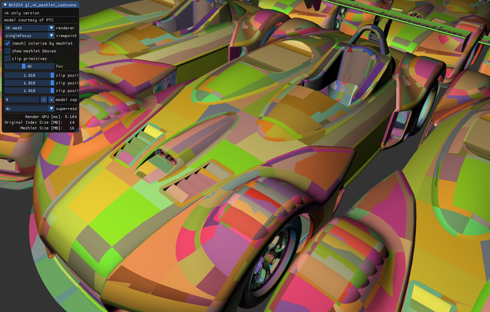

# Vulkan CAD Mesh Shader Sample

This branch is the [Circle C++ shaders](https://github.com/seanbaxter/shaders/blob/master/README.md) port of [Christoph Kubisch](https://twitter.com/pixeljetstream)'s **[Vulkan meshlet cadscene sample](https://github.com/nvpro-samples/gl_vk_meshlet_cadscene/)**.

Compile with [Circle build 112](https://www.circle-lang.org).

You'll need the dependencies listed [here](https://nvpro-samples.github.io/vk_mini_path_tracer/index.html#hello,vulkan!/settingupyourdevelopmentenvironment/installdependencies).

To build, try this:

```
# Download the nvpro framework.
$ mkdir meshlet
$ cd meshlet
meshlet$ git clone git@github.com:nvpro-samples/shared_sources
meshlet$ git clone git@github.com:nvpro-samples/shared_external

# Download the circle branch of the project
meshlet$ git clone git@github.com:seanbaxter/gl_vk_meshlet_cadscene -b circle
meshlet$ cd gl_vk_meshlet_cadscene

# Point cmake to circle. If it's in the path, it's real easy.
meshlet/gl_vk_meshlet_cadscene$ mkdir build
meshlet/gl_vk_meshlet_cadscene$ cd build
meshlet/gl_vk_meshlet_cadscene/build$ cmake -DCMAKE_CXX_COMPILER=circle ..

# Compile with some number of cores.
meshlet/gl_vk_meshlet_cadscene/build$ make -j4

# Run the sample. Have fun.
meshlet/gl_vk_meshlet_cadscene/build$ ../../bin_x64/vk_meshlet_cadscene.exe
```

